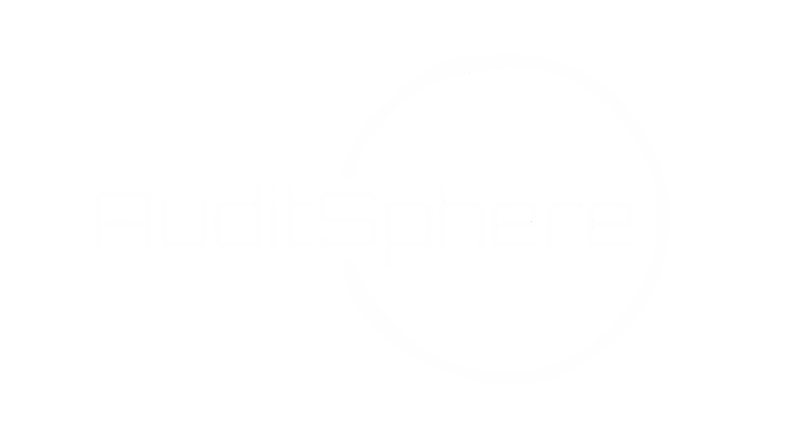

# AuditSphere - File Server Auditing and Monitoring Software

🔒 Enhance the security and compliance of your Windows and Linux file servers with AuditSphere! 🔍

## Introduction

AuditSphere is a powerful, open-source file server auditing and monitoring software designed to enhance security and compliance for both Windows and Linux systems. In an era where data breaches and unauthorized access are on the rise, AuditSphere provides real-time monitoring and auditing capabilities to help organizations stay ahead of potential threats.

### Project Background 🌐

AuditSphere was created to address the growing need for comprehensive file server auditing and monitoring solutions. It offers an integrated solution for Windows and Linux environments, ensuring consistent security measures.

### Project Aims & Objectives 🎯

**Project Aims:**
- Provide cross-platform integration to cover both Windows and Linux systems.
- Implement real-time monitoring and alerting for proactive threat detection.
- Ensure compliance with data protection regulations (e.g., GDPR, CCPA, etc.).
- Offer a user-friendly interface for easy setup and usage.
- Ensure scalability and performance to accommodate diverse environments.
- Enhance forensic analysis capabilities for incident response and investigation.

## Software 💻

AuditSphere consists of two main components:
- **Client:** Install this on your file server.
- **Server:** A Django web application that stores logs and provides a user-friendly interface.

## Features 🚀

AuditSphere offers a range of powerful features, including:

- 📁 File Added
- 🗑️ File Removed
- 📝 File Modified
- 🔄 File Renamed
- 📦 File Moved
- 👤 Owner Changed
- 🔒 ACL (Access Control List) Changed
- ✔️ Successful Action Logging
- 🚧 Failed Action Logging (In Progress)

AuditSphere records the following information for each action:
- ⏰ Time of Action
- 👤 User Who Performed the Action
- 🌐 IP Address of User's Computer

### Supported Protocols 🌐

AuditSphere currently supports the following protocols:
- SMB (Server Message Block)
- NFS (Network File System)

Please note that we are actively working on improving our feature set and expanding protocol support. 

## Reports 📊

This repository includes project reports covering various aspects of the project, including detailed requirement gathering, design, implementation, testing, and conclusions.

## Getting Started 🚀

### Installation

Learn how to install AuditSphere by following the instructions in the [Installation Guide](link_to_installation_guide.md).

### Usage

Get started with AuditSphere by referring to our [User Guide](link_to_user_guide.md) for effective usage.

## Contributing 🤝

We welcome contributions from the community! Please read our [Contribution Guidelines](link_to_contributing.md) to get started.

## License 📜

This project is licensed under the [GNU General Public License 3](LICENSE.txt), making it open-source and accessible to all.
